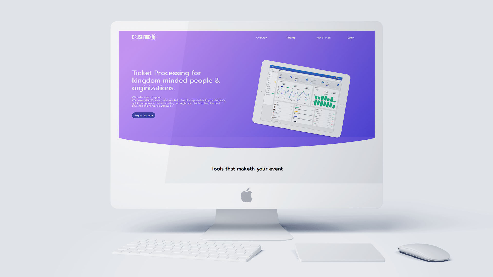

# A Concept Redesign for Brushfire

## By Carlos Martinez

Hey! You already know me, but just a quick refresher: I'm a Senior Identity & Design Consultant and I work on making great brands and helping them leave lasting impressions.
So, here I present my vision of a future Brushfire website.
(This is a perspective on how I as a consultant view the world, please take no offense)

### Props
    - Churn preventing hero! No major hype, offering a demo of the product is perfect!
    - Clear copy, No frills no technical BS and easy to read
    - Responsive Design
    - Genuine Reviews
    
### No No's
    - Unclear Above the Fold hero content, it's unclear at a glance what you do, you really have to look and read into the content
    - Fake parallax! (WHY! MY EYES! Use real parallax please!)
    - Boring copy. While clear, it's boring and feels to formal, this bores a younger audience 
    - Poor use of animations - poor animations in general.
    - Out dated design. My first thought was - This is a Bootstrap based site.
    - No real order to the page. Testimonials are everywhere, icons all over the place etc...
    
So with this in mind let's make something great. Removing everything except 3 of the notes in the Props category.

## Concept
A clean, colorful, site that feels playful and has a genuine voice to it.
We keep the hero clean with our request a demo button, but we add a mockup with a preview of our tool (abate it is fake in this case)
Next we have our 3 most important selling points of our tool, followed 2 points in depth.
Later we show that we integrate with popular tools, and end with a few reviews.

### Copy and Visual Appeal
I stated earlier that the site had clear UX copy, but it fell short in feeling playful and authentic, so I included baseline UX copy design idea in the page, its playful, clear, and honest, yet still sells the product clearly.
The design is clean, driven by geometry, mostly circular and waves. It also has clean eye popping colors for quick attention drawing and guidance.

## Notes

    - All the icons were made by hand in AI with material design as the focus.
    - The Dashboard images were from a previous project I made and is free for your use.
    - SMACSS is the design architecture, but BEM would be the best alternative if this is taken into production.
    - The site is responsive, but the grid system doesn't achieve full parity as margins on mobile aren't fully optimized.
    - This was a 36 hour project sprint (I hope that it doesn't show!).
    
## Closing thoughts
I meant it when I said that this project is free for your corporate use, I hope you enjoy it (and use it!) truly! While I'm sad that I won't be the man that you hire this round I do hope to work with you in the near future. If you want to extend this project into something official and want to have me work on it, please do let me know, I love working with great brands like yours.
In any case, Thank you for the chance you gave me and I hope to hear from you soon!
P.D Please let me know what your people think of the concept, be it positive or negative! I want to better my skills and that feedback would help!
- Best,
Carlos M.

For:

    - Stan Coker (Hello future boss!)
    - Jorin Slaybaugh (Special Thanks to you!)
    - Nic Rodriquez (Your input is highly requested)
    - The Entire Brushfire team! (You all look incredible - especially you!)
    

